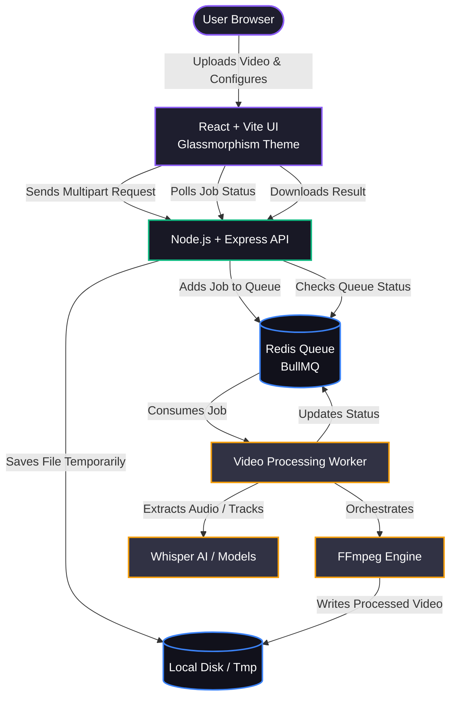

<div align="center">
  <h1>✨ Immortall69 Video Processor ✨</h1>
  <p><strong>A comprehensive, premium full-stack video processing application with Glassmorphism UI, AI tracking, and advanced FFmpeg capabilities.</strong></p>
</div>

<hr/>

## 🚀 Overview

The **Immortall69 Video Processor** is a professional-grade web application designed to handle heavy video transformation and metadata manipulation. Featuring a stunning **Bento Box Glassmorphism UI**, the tool offers a seamless and powerful user experience. 

Under the hood, it utilizes a highly optimized **Node.js/Express backend**, distributed job queues via **Redis & BullMQ**, and the raw processing power of **FFmpeg** and **Whisper AI** for heavy computational tasks like object tracking and auto-subtitling.

---

## 🏗 Architecture Diagram

Here is a high-level overview of how the frontend, backend, and processing services interact:



---

## ✨ Key Features

### 🎨 1. Premium Interface (Bento Glassmorphism)
- Completely redesigned UI with a modern, cyberpunk-inspired **Deep Obsidian & Amethyst** theme.
- **Glassmorphism panels** and dynamic background radial gradients.
- High-quality geometric typography powered by the **Outfit** font.

### 🎥 2. Advanced Video Transformation
- **Trim & Crop:** Precise timing manipulation and visual cropping.
- **Speed & FPS Conversion:** Variable speed ramps and frame interpolation.
- **Micro-Tilt & Reframe:** Adjust rotation and vertical cropping for social media.

### 🎭 3. Visual & Artistic Effects
- Add **Watermarks**, dynamic **Zoom**, and **Hue rotations**.
- Overlay secondary videos (**Split-screen**).
- Introduce **Film grain** and **Temporal Frame Jitter** for stylistic purposes.
- **Face/Privacy Blurring** with adjustable strength.

### 🎧 4. Audio Manipulation
- **Pitch shifting** and **EQ presets** (e.g. cut low, boost high).
- Adjust **Noise floor** to clean up background hiss.
- Replace, mix, or mute audio tracks entirely.

### 🤖 5. AI Capabilities
- Built-in **Whisper AI integration** for generating highly accurate auto-subtitles.
- **AI Object Tracking** for advanced overlays.

### 🛡️ 6. Metadata Management
- Safely remove EXIF data and other embedded metadata.
- Inject custom titles, authors, comments, and copyright information.

---

## 🛠️ Complete Installation Guide

### Prerequisites
Before you start, ensure you have the following installed on your machine:
- **[Node.js](https://nodejs.org/)** (v18 or higher is recommended)
- **[Redis](https://redis.io/)** (Must be running on `localhost:6379` natively or via Docker)
- **[FFmpeg](https://ffmpeg.org/)** (Required for the backend to process videos natively)

### Step 1: Clone the Repository
```bash
git clone https://github.com/nandan069/tools.git
cd tools
```

### Step 2: Setup the Backend
The backend handles all heavy lifting, queue management, and actual video processing.

1. Navigate to the backend directory:
   ```bash
   cd video-processor-backend
   ```
2. Install dependencies (this automatically triggers scripts to fetch fonts and Whisper binaries):
   ```bash
   npm install
   ```
3. Ensure **Redis** is running in the background. If you have Docker installed, you can use the provided compose file:
   ```bash
   docker-compose up -d redis
   ```
   *(Alternatively, run `redis-server` natively if installed).*
4. Start the backend processing server:
   ```bash
   npm start
   ```
   *The backend will now be actively listening on `http://localhost:3001`.*

### Step 3: Setup the Frontend
The frontend provides the sleek, interactive dashboard for configuring your processing jobs.

1. Open a **new terminal window** and navigate to the frontend directory:
   ```bash
   cd video-processor
   ```
2. Install frontend dependencies:
   ```bash
   npm install
   ```
3. Start the Vite development server:
   ```bash
   npm run dev
   ```
4. Open your browser and navigate to the URL provided by Vite (usually `http://localhost:5173`).

---

## ⚙️ Environment Variables (Optional)

If you need to customize ports, paths, or API URLs, you can set up environment variables:

- **Frontend (`video-processor/.env`):**
  ```env
  VITE_API_URL=http://localhost:3001
  ```

- **Backend (`video-processor-backend/.env`):**
  ```env
  PORT=3001
  REDIS_HOST=127.0.0.1
  REDIS_PORT=6379
  ```

---

<div align="center">
  <p><strong>© 2026 All Rights Reserved to Immortall69</strong></p>
  <p><em>Built for performance, designed for aesthetics.</em></p>
</div>
